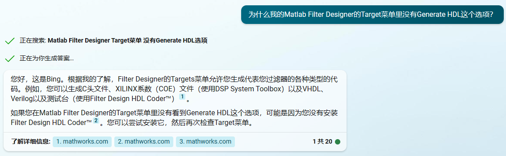
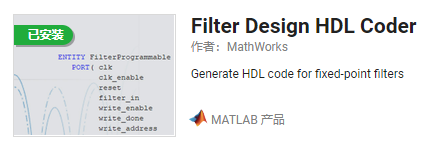

# FPGA_QAM_Modulation

## TODO

- [ ] 正弦波产生(Sin)

- [ ] 正弦波产生(Cos)

- [x] 信号产生(M序列发生器)

- [ ] 时钟分频模块

- [ ] 串并转换模块

- [ ] IQ调制

- [ ] QPSK调制

- [ ] 16QAM调制

- [ ] 升余弦滤波器设计

- [ ] 顶层控制模块

  

## 关于速率

| 符号速率   | QPSK输入串行流 | 16QAM输入串行流 |
| ---------- | -------------- | --------------- |
| 2400 Baud  | 9600 bit/s     | 38400 bit/s     |
| 4800 Baud  | 19200 bit/s    | 76800 bit/s     |
| 9600 Baud  | 38400bit/s     | 153600 bit/s    |
| 19200 Baud | 76800 bit/s    | 307200 bit/s    |

## 关于滤波器

在QAM调制系统中，波形成型通常使用根升余弦滤波器。由于根升余弦滤波器需要具有线性相位特性，因此应该选择FIR滤波器来实现。FIR滤波器可以保证不同频率分量的信号经过滤波器后它们的时间差不变，从而避免符号间干扰。

